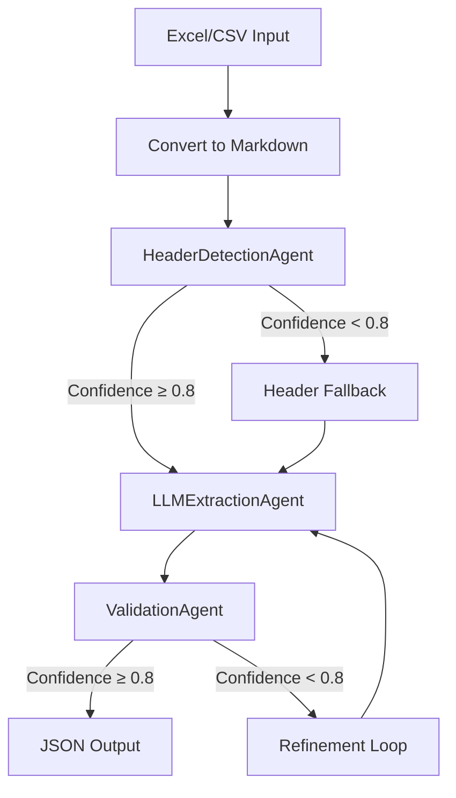

# Excel Header Mapper with LLM-Based Agents

This project implements an intelligent Excel header mapping system using LLM-based agents. It can analyze Excel/CSV files, detect headers, extract structured data, and validate the results.

## Architecture

The system uses a pipeline of three LLM-based agents:



## Agents

### 1. HeaderDetectionAgent

Analyzes the first 15 rows of a sheet to determine:
- Where headers start and end
- Where content starts
- Confidence score for the detection

### 2. LLMExtractionAgent

Processes the structured markdown with identified headers to:
- Extract data for each section (identifier, denomination, etc.)
- Use few-shot prompting for accurate extraction

### 3. ValidationAgent

Validates and corrects the extracted data:
- Checks for inconsistencies and errors
- Provides confidence score for validation
- Lists corrections made

## Usage

### Command Line Interface

```bash
python cli_header_mapper.py --input_dir=<directory> --output_dir=<output_directory>
```

### Test Script

To test the agent pipeline on a single file:

```bash
python test_agent_pipeline.py <path_to_excel_or_csv_file>
```

## Implementation Details

The system is implemented with the following components:

1. **Data Models** (`src/models.py`):
   - Defines the data structures for extraction
   - Includes validation models with confidence scoring

2. **Agent Implementation** (`src/extraction/agents.py`):
   - Implements the three LLM-based agents
   - Includes the pipeline coordinator

3. **Processing Logic** (`src/processing.py`):
   - Orchestrates the extraction process
   - Handles file I/O and statistics

4. **Excel Processing** (`src/extraction/excel.py`):
   - Converts Excel/CSV files to markdown format

## Configuration

The system can be configured with the following options:

- `input_dir`: Directory containing Excel/CSV files
- `output_dir`: Directory for JSON output
- `start_row`: First row to read (0-based)
- `end_row`: Last row to read (exclusive)
- `all_sheets`: Process all sheets in Excel files
- `model_name`: LLM model name
- `base_url`: LLM API base URL
- `api_key`: API key for the LLM
- `temperature`: Temperature for LLM generation
- `max_retries`: Maximum retries for LLM API calls

## Development

### Adding New Extraction Models

1. Define a new model class in `src/models.py`
2. Add the model to `EXTRACTION_MODELS` dictionary
3. Create examples for the model in the agent implementation

### Customizing Agent Behavior

The agents can be customized by:
- Modifying the prompt templates
- Adjusting confidence thresholds
- Adding more examples for few-shot learning

## License

This project is licensed under the MIT License - see the LICENSE file for details.
