# LLM-Based Excel Extraction Pipeline

## Overview

- **Classifies document type and validates classification as the first step.**
- Extracts structured data from Excel/CSV files using LLM agents.
- Supports **header detection, extraction, validation**.
- Fully **configurable** via JSON.
- Can be used as a **CLI tool** or **HTTP API**.

---

## Setup

1.  **Clone the repository:**
    ```bash
    git clone <repository_url>
    cd agent_extraction
    ```

2.  **Create a virtual environment:**
    ```bash
    python -m venv .venv
    ```

3.  **Activate the virtual environment:**
    - On macOS/Linux:
      ```bash
      source .venv/bin/activate
      ```
    - On Windows:
      ```bash
      .venv\Scripts\activate
      ```

4.  **Install dependencies:**
    ```bash
    pip install -r requirements.txt
    ```
    *(Note: The script header in `run_pipeline.py` also lists dependencies, ensure `requirements.txt` is up-to-date with these.)*

5.  **Set up Application Configuration:**
    - Create a file named `config/app_config.json`.
    - This file should contain application-level settings like input/output directories and LLM configurations.
    - A basic structure might look like this:
      ```json
      {
        "input_dir": "input",
        "output_dir": "json_outputs",
        "start_row": 0,
        "end_row": 15,
        "all_sheets": false,
        "model": {
          "model_name": "your-main-llm-model",
          "base_url": "your-main-llm-url",
          "api_key": "your-main-llm-api-key"
        },
        "classification_model": {
          "model_name": "your-classification-llm-model",
          "base_url": "your-classification-llm-url",
          "api_key": "your-classification-llm-api-key",
          "max_tokens": 4000,
          "context_window_percentage": 0.45
        },
        "include_header_examples_in_prompt": true,
        "enable_deduplication_agent": true,
        "classification_prompt": "classifier_agent_v2_2.md",
        "classification_validation_prompt": "classifier_validation_agent_v1.md",
        "classification_labels": [
          "Mutual Funds", "ETF", "Stocks", "Bonds", "Real State",
          "Crypto Asset", "Commodities", "Private Equities", "Index",
          "Currencies Pairs", "None of those"
        ]
      }
      ```
    - Update the values with your specific LLM details and desired settings.

6.  **Set up Dynamic Extraction Configurations:**
    - Create JSON files in the `config/` directory for each document class you want to process (e.g., `config/full_config_Mutual_Funds.json`).
    - These files define the header detection, validation, extraction models, and prompts specific to that document type.
    - Refer to existing config files in the `config/` directory for examples.

---

## How to Run the App

Ensure your virtual environment is activated and dependencies are installed.

### 1. CLI Mode

Run the pipeline from the command line:

```bash
python run_pipeline.py --app-config config/app_config.json --file input/myfile.xlsx --output output/result.json
```

- `--app-config`: Path to the application configuration file (defaults to `config/app_config.json`).
- `--file`: Path to a specific Excel or CSV file to process. If omitted, all `.xlsx`, `.xls`, `.csv`, `.XLS` files in the `input_dir` specified in `app_config.json` will be processed.
- `--sheet`: Specific sheet name to process within the Excel file (optional).
- `--output`: Path to save the output JSON file. If omitted, output will be printed to the console (only for single file processing).

### 2. API Mode

Start the FastAPI server:

```bash
uvicorn api_main:app --reload --host 0.0.0.0 --port 8000
```

- The API will load application configuration from `config/app_config.json` by default, or from the path specified by the `APP_CONFIG_PATH` environment variable.

Call the API using a tool like `curl` or a client library:

```bash
curl -X POST "http://localhost:8000/extract" \
  -F "file=@input/myfile.xlsx"
```

- Upload the Excel or CSV file using the `file` form data field.
- The API will classify the document, load the corresponding dynamic configuration, run the pipeline, and return the extraction result as JSON.

---

## How to Run Tests

Ensure your virtual environment is activated and dependencies are installed.

1.  **Install pytest:**
    ```bash
    pip install pytest pytest-mock
    ```
    *(Note: `pytest-mock` is needed for mocking dependencies in tests.)*

2.  **Run the tests:**
    ```bash
    pytest
    ```

- This will discover and run all tests in the `tests/` directory.
- You can run specific test files or tests using pytest command-line options (e.g., `pytest tests/test_config.py`).

---

## Configuration

- All extraction logic is driven by **configuration files**.
- **Application Configuration (`config/app_config.json` or specified by `--app-config`/`APP_CONFIG_PATH`):** Contains application-level settings, LLM configurations, input/output directories, and global flags.
- **Dynamic Extraction Configurations (`config/full_config_[class_name].json`):** Loaded dynamically based on document classification. These define:
  - Header detection settings and examples.
  - Extraction models, fields, and examples.
  - Validation thresholds.
  - Prompt file names for different agents.
- **Application Settings:** Additional settings like `include_header_examples_in_prompt` (default: `true`) control behavior like injecting field examples into LLM prompts. These are managed within the `AppConfig` model (`src/models.py`).

---

## Architecture

- **`run_pipeline.py`**: CLI wrapper.
- **`api_main.py`**: FastAPI app providing the HTTP interface.
- **`src/models.py`**: Defines Pydantic data models for configuration (`AppConfig`, `ExtractionConfig`, etc.) and pipeline outputs.
- **`src/config_manager.py`**: Handles loading and Pydantic validation of dynamic extraction configurations.
- **`src/extraction/dynamic_agents.py`**: Contains the `DynamicAgentPipelineCoordinator` which orchestrates the entire pipeline, including classification, validation, and dynamic configuration loading. Also contains definitions for the various dynamic agents (`DynamicClassificationAgent`, `DynamicClassificationValidationAgent`, `DynamicHeaderDetectionAgent`, `DynamicHeaderValidationAgent`, `DynamicExtractionAgent`, `DynamicValidationAgent`, `DynamicDeduplicationAgent`).
- **`src/extraction/extract_core.py`**: Contains the `run_extraction` function which likely utilizes the `DynamicAgentPipelineCoordinator`.
- **`src/utils/`**: Directory for utility functions (display, formatting, prompt loading).
- **`tests/`**: Directory containing the comprehensive test suite.
- **The pipeline dynamically loads extraction and validation configurations based on the document classification result.**

```mermaid
flowchart TD
    Input[Excel/CSV Input] --> Classify[Classification Agent]
    Classify --> ClassifyValidate[Classification Validation Agent]
    ClassifyValidate --> Convert[Convert to Markdown]

    Convert --> HeaderDetect[HeaderDetectionAgent]

    HeaderDetect --> HeaderValidate[HeaderValidationAgent]
    HeaderValidate -->|Confidence ≥ 0.7| Extract[LLMExtractionAgent]
    HeaderValidate -->|Confidence < 0.7| Error[Error: Header Detection Failed]

    Extract --> Validate[ValidationAgent]

    Validate --> Output[JSON Output]

    subgraph "Integration with Existing Code"
        HeaderDetect -.-> Process[processing.py]
        HeaderValidate -.-> Process
        Extract -.-> Process
        Validate -.-> Process
        Process -.-> Output
    end
```



---

## Features

- Extracts **currency symbols** and **formats** from Excel.
- Supports `.xlsx`, `.xls` (with conversion), `.csv`.
- Trims empty columns for clean output.
- Modular, extensible design.
- **Dynamic configuration loading based on document classification.**
- **Integrated logging for better observability.**
- **Comprehensive test suite for reliability.**

## To do

* **Access to the Hill git**

* **Ground truth status**

* **Add ollama integration**

* **Add information about type of extraction**

It can be:
- column: The information is located in a header cell of a specific column.
- row: The information is located in a specific row of the table.
- fixed: The information is always in a particular cell within the table.
- deductive: I need to analyze the data within the table to infer or deduce the required information.


* **How to create examples more dynamicly**

* **Implement custom exception types.**

* **Further performance optimization.**

* **Complete code quality improvements (type hints, docstrings, refactoring).**

* **Enhance detailed documentation (beyond README).**

* **Review security considerations.**

* **Conduct a full dynamism review.**

* **Create swagger api documentation.**

* **Create meeting with Nikola about implementation code in prod.**
