# LLM-Based Excel Extraction Pipeline

## Overview

- Extracts structured data from Excel/CSV files using LLM agents.
- Supports **header detection, extraction, validation**.
- Fully **configurable** via JSON.
- Can be used as a **CLI tool** or **HTTP API**.

---

## Usage

### 1. CLI Mode

Run extraction on a file:

```bash
python run_pipeline.py --config config/full_config.json --file input/myfile.xlsx --output output/result.json
```

- `--config`: Path to extraction config JSON.
- `--file`: Excel or CSV file.
- `--output`: Save output JSON (optional).
- `--sheet`: Sheet name (optional).

### 2. API Mode

Start the API server:

```bash
uvicorn api_main:app --reload --host 0.0.0.0 --port 8000
```

Call the API:

```bash
curl -X POST "http://localhost:8000/extract" \
  -F "file=@input/myfile.xlsx" \
  -F "config_json=$(cat config/full_config.json)"
```

- Upload Excel file and config JSON.
- Receives extraction result as JSON.

---

## Configuration

- All extraction logic is driven by a **config JSON** (see `config/full_config.json`).
- Define:
  - Header detection settings and examples.
  - Extraction models, fields, and examples.
  - Validation thresholds.
- **Application Settings:** Additional settings like `include_header_examples_in_prompt` (default: `true`) control behavior like injecting field examples into LLM prompts. These are managed within the `AppConfig` model (`src/models.py`).

---

## Architecture

- **`src/extraction/extract_core.py`**: Core extraction function used by CLI and API.
- **`run_pipeline.py`**: CLI wrapper.
- **`api_main.py`**: FastAPI app.
- **`test_excel_formatting.py`**: Excel formatting extraction prototype.
- **`config/full_config.json`**: Extraction configuration.

---

## Features

- Extracts **currency symbols** and **formats** from Excel.
- Supports `.xlsx`, `.xls` (with conversion), `.csv`.
- Trims empty columns for clean output.
- Modular, extensible design.


## To do

* **Address duplicate header data resulting from separate group extractions.**
    * *Problem:* Data extraction is currently performed separately for each data group. Consequently, the same header information can appear in multiple extracted groups.
    * *Task:* Define a method to handle this redundancy (e.g., consolidate, deduplicate) after the initial extraction phase.

* **Access to the Hill git**

* **Ground truth status**

* **Agent csv to markdown table**
    * Create agent if csv dont have table infor to convert table to markdown  

* **Add information about type of extraction**

It can be:
- column: The information is located in a header cell of a specific column.
- row: The information is located in a specific row of the table.
- fixed: The information is always in a particular cell within the table.
- deductive: I need to analyze the data within the table to infer or deduce the required information.


* **How to create examples more dynamicly**

* **Extraction process diagram**

```mermaid
flowchart TD
    Input[Excel/CSV Input] --> Convert[Convert to Markdown]
    Convert --> HeaderDetect[HeaderDetectionAgent]

    HeaderDetect --> HeaderValidate[HeaderValidationAgent]
    HeaderValidate -->|Confidence ≥ 0.7| Extract[LLMExtractionAgent]
    HeaderValidate -->|Confidence < 0.7| Error[Error: Header Detection Failed]

    Extract --> Validate[ValidationAgent]

    Validate --> Output[JSON Output]

    subgraph "Integration with Existing Code"
        HeaderDetect -.-> Process[processing.py]
        HeaderValidate -.-> Process
        Extract -.-> Process
        Validate -.-> Process
        Process -.-> Output
    end
```


