# System Patterns

This document outlines the system architecture, key technical decisions, and design patterns used in the project.

## Architecture
- The system follows a pipeline architecture where data flows through a series of processing steps (**Classification, Classification Validation**, Convert to Markdown, Header Detection, Header Validation, Extraction, Validation).
- It utilizes LLM agents for core processing steps.
- The system is designed to be modular and extensible, allowing for the addition of new agents or steps.
- Integration with existing code (`processing.py` mentioned in the diagram) is part of the flow.
- **Configuration is loaded dynamically based on the result of the classification step.**

```mermaid
flowchart TD
    Input[Excel/CSV Input] --> Classify[Classification Agent]
    Classify --> ClassifyValidate[Classification Validation Agent]
    ClassifyValidate --> Convert[Convert to Markdown]

    Convert --> HeaderDetect[HeaderDetectionAgent]

    HeaderDetect --> HeaderValidate[HeaderValidationAgent]
    HeaderValidate -->|Confidence ≥ 0.7| Extract[LLMExtractionAgent]
    HeaderValidate -->|Confidence < 0.7| Error[Error: Header Detection Failed]

    Extract --> Validate[ValidationAgent]

    Validate --> Output[JSON Output]

    subgraph "Integration with Existing Code"
        HeaderDetect -.-> Process[processing.py]
        HeaderValidate -.-> Process
        Extract -.-> Process
        Validate -.-> Process
        Process -.-> Output
    end
```

## Design Patterns
- **Agent-based processing:** Core logic is encapsulated in distinct agents (**DynamicClassificationAgent, DynamicClassificationValidationAgent**, HeaderDetectionAgent, HeaderValidationAgent, LLMExtractionAgent, ValidationAgent, DeduplicationAgent).
- **Configuration-driven:** Behavior is controlled by external JSON configuration rather than hardcoded logic.
- **Modular Design:** Components are designed to be independent and interchangeable.
- **Dynamic Configuration Loading:** Extraction and validation configurations are loaded dynamically based on the document classification result.

## Key Decisions
- Using LLMs for flexible and adaptable data extraction.
- Implementing a configurable pipeline for different document structures.
- Providing both CLI and API interfaces for broad usability.
- **Adding initial classification and validation steps to dynamically load the correct configuration.**

## Component Relationships
- `run_pipeline.py` acts as a CLI wrapper for the core extraction logic.
- `api_main.py` provides an HTTP interface to the core extraction logic.
- `src/extraction/dynamic_agents.py` contains the `DynamicAgentPipelineCoordinator` which orchestrates the entire pipeline, including classification, validation, and dynamic config loading. It also contains the definitions for `DynamicClassificationAgent` and `DynamicClassificationValidationAgent`.
- `src/extraction/extract_core.py` contains the `run_extraction` function which likely utilizes the `DynamicAgentPipelineCoordinator`.
- Configuration files (`config/full_config.json`, `config/full_config_[class_name].json`) drive the behavior of the agents and are loaded dynamically.
- `src/models.py` defines data structures like `AppConfig`, `ClassificationOutput`, and `ClassificationValidationOutput`.
