# 💡 Enhanced System Extension Plan: LLM-Based Agents Pipeline

---

## 🎯 **Key Principle**
All intelligent components in the pipeline — **extraction**, **header detection**, and **validation** — are implemented as **LLM Agents**. Each uses a well-structured prompt, and runs on a **local LLM (e.g., Gemma)** via your `GemmaLLMAgent`.

---

## 🔄 Pipeline Architecture

```mermaid
flowchart TD
    Input[Excel/CSV Input] --> Convert[Convert to Markdown]
    Convert --> HeaderDetect[HeaderDetectionAgent]
    
    HeaderDetect -->|Confidence ≥ 0.8| Extract[LLMExtractionAgent]
    HeaderDetect -->|Confidence < 0.8| FallbackH[Header Fallback]
    FallbackH --> Extract
    
    Extract --> Validate[ValidationAgent]
    
    Validate -->|Confidence ≥ 0.8| Output[JSON Output]
    Validate -->|Confidence < 0.8| Refine[Refinement Loop]
    Refine --> Extract
    
    subgraph "Integration with Existing Code"
        HeaderDetect -.-> Process[processing.py]
        Extract -.-> Process
        Validate -.-> Process
        Process -.-> Output
    end
```



---

## 🧠 Agent Specifications

### 🧩 1. **HeaderDetectionAgent (LLM Agent)**

#### ✅ Purpose:
- Analyze the **first 15 rows** of a sheet (provided in markdown format)
- Determine:
  - `header_start_line`
  - `header_end_line`
  - `content_start_line`
  - `header_detection_confidence` (0.0–1.0)

#### 🔗 Implementation Pattern:
Uses this format internally:
```python
def extract_section(markdown_content, section_name, model_class, messages, llm):
```

- `markdown_content`: First 15 rows of the sheet, converted to markdown
- `section_name`: `"HeaderDetection"`
- `model_class`: `ContextModel` (includes start/end lines + confidence)
- `messages`: Prompt messages for the LLM
- `llm`: Your local GemmaLLMAgent instance

#### 🎯 Output:
Populates `ContextModel`:
```json
{
  "header_start_line": 3,
  "header_end_line": 4,
  "content_start_line": 5,
  "header_detection_confidence": 0.94
}
```

#### 🔄 Class Implementation:
```python
class HeaderDetectionAgent:
    def __init__(self, llm):
        self.llm = llm
        self.messages = self._create_example_messages()
        
    def detect_headers(self, markdown_content):
        """Detect header positions in markdown content."""
        return extract_section(
            markdown_content=markdown_content,
            section_name="HeaderDetection",
            model_class=ContextModel,
            messages=self.messages,
            llm=self.llm
        )
        
    def _create_example_messages(self):
        # Create example messages for few-shot learning
        # Return formatted messages for the LLM
```

#### 🔄 Fallback Strategy:
- If confidence < 0.8, use heuristic detection:
  - Look for rows with different formatting
  - Identify first row with numeric data
  - Default to header_start_line=0, header_end_line=1, content_start_line=2

---

### 🧩 2. **LLMExtractionAgent (Existing Agent)**

#### ✅ Purpose:
- Process structured markdown (headers + 10 rows of content)
- Extract data for each section (identifier, denomination, etc.)
- Uses few-shot prompting and validation inside the prompt design

#### 🔗 Implementation Pattern:
```python
def extract_section(markdown_content, section_name, model_class, messages, llm)
```

#### 🔄 Enhanced Implementation:
```python
class LLMExtractionAgent:
    def __init__(self, llm):
        self.llm = llm
        self.section_messages = {}
        
    def extract_data(self, markdown_content, header_info, section_name, model_class):
        """Extract data for a specific section."""
        # Use header_info to focus on relevant rows
        focused_content = self._focus_content(markdown_content, header_info)
        
        # Get or create example messages for this section
        if section_name not in self.section_messages:
            self.section_messages[section_name] = self._create_section_messages(section_name)
            
        return extract_section(
            markdown_content=focused_content,
            section_name=section_name,
            model_class=model_class,
            messages=self.section_messages[section_name],
            llm=self.llm
        )
        
    def _focus_content(self, markdown_content, header_info):
        """Focus on relevant rows based on header detection."""
        # Implementation to extract header + 10 rows of content
        
    def _create_section_messages(self, section_name):
        """Create example messages for a specific section."""
        # Implementation to create section-specific examples
```

---

### 🧩 3. **ValidationAgent (LLM Agent)**

#### ✅ Purpose:
- Receives initial extracted data per section
- Validates structure, corrects inconsistencies (via prompt)
- Returns cleaned/confirmed data + **confidence score (0.0–1.0)**

#### 🔗 Implementation Pattern:
```python
def extract_section(json_input_as_text, section_name, model_class, messages, llm)
```

- Uses JSON as markdown-like input for validation
- Provides repaired and confidence-rated output per section

#### 🎯 Output:
```json
{
  "validated_data": {
    "code": "CODE ISIN",
    "code_type": "Isin",
    "currency": "EUR",
    "cic_code": null
  },
  "validation_confidence": 0.92,
  "corrections_made": ["Fixed currency format from 'Euro' to 'EUR'"]
}
```

#### 🔄 Class Implementation:
```python
class ValidationAgent:
    def __init__(self, llm):
        self.llm = llm
        self.messages = self._create_validation_messages()
        
    def validate(self, extracted_data, section_name, model_class):
        """Validate extracted data for a specific section."""
        # Convert extracted data to JSON string
        json_input = json.dumps(extracted_data.model_dump())
        
        # Create validation model class that extends the original
        validation_model = self._create_validation_model(model_class)
        
        return extract_section(
            markdown_content=json_input,
            section_name=f"{section_name}Validation",
            model_class=validation_model,
            messages=self.messages,
            llm=self.llm
        )
        
    def _create_validation_model(self, model_class):
        """Create a validation model that extends the original model."""
        # Dynamically create a model with validation_confidence and corrections_made
        
    def _create_validation_messages(self):
        """Create example messages for validation."""
        # Implementation to create validation examples
```

---

## 🔄 Pipeline Coordinator

### ✅ Purpose:
- Orchestrate the entire extraction pipeline
- Handle agent interactions and fallbacks
- Integrate with existing processing.py workflow

### 🔄 Implementation:
```python
class AgentPipelineCoordinator:
    def __init__(self, config):
        self.config = config
        self.llm = configure_llm(config)
        self.header_agent = HeaderDetectionAgent(self.llm)
        self.extraction_agent = LLMExtractionAgent(self.llm)
        self.validation_agent = ValidationAgent(self.llm)
        
    def process_markdown(self, markdown_content, source_file):
        """Process markdown content through the agent pipeline."""
        results = {}
        
        # Step 1: Detect headers
        header_info = self.header_agent.detect_headers(markdown_content)
        
        # Check confidence and use fallback if needed
        if header_info and header_info.header_detection_confidence >= 0.8:
            console.print(f"[green]✓[/green] Header detection successful with confidence {header_info.header_detection_confidence:.2f}")
        else:
            console.print("[yellow]⚠[/yellow] Low confidence in header detection, using fallback strategy")
            header_info = self._header_fallback(markdown_content)
        
        # Step 2: Extract each section
        for section_name, model_class in EXTRACTION_MODELS.items():
            # Initialize section results
            results[section_name] = {k: None for k in model_class().model_fields.keys()}
            
            # Extract data
            extracted_data = self.extraction_agent.extract_data(
                markdown_content, 
                header_info, 
                section_name, 
                model_class
            )
            
            if not extracted_data:
                console.print(f"[yellow]⚠[/yellow] No data extracted for {section_name}")
                continue
                
            # Step 3: Validate data
            validated_result = self.validation_agent.validate(
                extracted_data,
                section_name,
                model_class
            )
            
            # Check validation confidence
            if validated_result and validated_result.validation_confidence >= 0.8:
                # Update results with validated data
                validated_data = validated_result.validated_data.model_dump()
                for field, value in validated_data.items():
                    if value is not None:
                        results[section_name][field] = value
                        
                console.print(f"[green]✓[/green] Validated {section_name} with confidence {validated_result.validation_confidence:.2f}")
            else:
                # Use original extraction if validation fails
                console.print(f"[yellow]⚠[/yellow] Low validation confidence for {section_name}, using original extraction")
                result_data = extracted_data.model_dump()
                for field, value in result_data.items():
                    if value is not None:
                        results[section_name][field] = value
        
        return results
        
    def _header_fallback(self, markdown_content):
        """Fallback strategy for header detection."""
        # Implementation of heuristic-based header detection
```

---

## 🔌 Integration with Existing Code

### 1. **Modify processing.py**:

```python
# In processing.py

def extract_all_sections(markdown_content, source_file, config, llm_pipeline, messages):
    """
    Extract all sections from markdown content using the agent pipeline.
    """
    # Initialize the agent pipeline
    agent_pipeline = AgentPipelineCoordinator(config)
    
    # Process the markdown content
    results = agent_pipeline.process_markdown(markdown_content, source_file)
    
    # Rest of the function remains the same (statistics, JSON output, etc.)
    # ...
    
    return results
```

### 2. **Add New Models**:

```python
# In models.py

# Add validation model base class
class ValidationResult(BaseModel):
    """Base model for validation results."""
    validation_confidence: float = Field(0.0, description="Confidence in validation (0.0-1.0)")
    corrections_made: List[str] = Field([], description="List of corrections made during validation")

# Add header detection confidence to ContextModel
class ContextModel(BaseExtraction):
    """Model for extracting context information."""
    file_name: Optional[str] = Field(None, description="File name of the Excel document")
    header_start_line: Optional[int] = Field(None, description="Line where headers start (1-based)")
    header_end_line: Optional[int] = Field(None, description="Line where headers end (1-based)")
    content_start_line: Optional[int] = Field(None, description="Line where content starts (1-based)")
    file_type: Optional[str] = Field(None, description="File type (xlsx, csv)")
    header_detection_confidence: Optional[float] = Field(None, description="Confidence in header detection (0.0-1.0)")
```

---

## 🧪 Testing & Evaluation

### 1. **Metrics**:
- Header detection accuracy (compared to manual labeling)
- Extraction field accuracy (% of correctly extracted fields)
- Validation effectiveness (% of errors caught and fixed)
- End-to-end processing time

### 2. **Test Cases**:
- Simple sheets with clear headers
- Complex sheets with multi-row headers
- Sheets with missing or ambiguous headers
- Sheets with varying data formats

### 3. **Evaluation Process**:
```python
def evaluate_pipeline(test_files, ground_truth, config):
    """Evaluate the agent pipeline against ground truth data."""
    metrics = {
        "header_detection": {"correct": 0, "total": 0},
        "extraction": {"correct": 0, "total": 0},
        "validation": {"fixed": 0, "missed": 0},
        "processing_time": []
    }
    
    # Implementation of evaluation logic
    # ...
    
    return metrics
```

---

## 🚀 Implementation Plan

1. **Phase 1: Core Agent Implementation**
   - Implement HeaderDetectionAgent
   - Integrate with existing extraction logic
   - Add basic fallback strategies

2. **Phase 2: Validation & Refinement**
   - Implement ValidationAgent
   - Add confidence scoring
   - Create refinement loops

3. **Phase 3: Pipeline Coordination**
   - Implement AgentPipelineCoordinator
   - Integrate with processing.py
   - Add performance optimizations

4. **Phase 4: Testing & Tuning**
   - Create evaluation framework
   - Test with diverse datasets
   - Tune prompts and confidence thresholds
