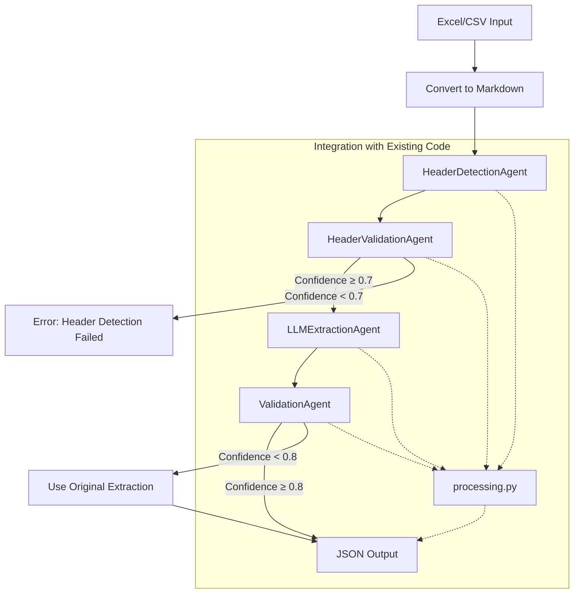

## 🎯 **Key Principle**

This document outlines the plan for enhancing the system extension using an LLM-based agents pipeline. The core principle is that all intelligent components within this pipeline – **extraction**, **header detection**, **header validation**, and **data validation** – will be implemented as **LLM Agents**. Each agent will utilize a well-structured prompt and will run on a **local LLM (e.g., Gemma)** via the `GemmaLLMAgent`.


## 🔄 Pipeline Architecture

The following diagram illustrates the architecture of the LLM-based agents pipeline:



**Pipeline Stages:**

1.  **Input**: The pipeline accepts Excel or CSV files as input.
2.  **Convert to Markdown**: The input file is converted into a Markdown format for easier processing by the LLM agents.
3.  **HeaderDetectionAgent**: This agent analyzes the first 15 rows of the Markdown content to identify the start and end lines of the header and content, along with a confidence score.
4.  **HeaderValidationAgent**: This agent validates the detected header information against the original table to ensure accuracy and provides a validation confidence score. If the confidence is below 0.7, the process is flagged as an error.
5.  **LLMExtractionAgent**: This agent extracts data from the structured Markdown content based on the identified headers.
6.  **ValidationAgent**: This agent validates the extracted data against the original table, corrects inconsistencies, and provides a final confidence score. If the confidence is below 0.8, the original extraction is used.
7.  **Output**: The final output is a JSON document containing the extracted and validated data.
8.  **Integration with Existing Code**: The pipeline seamlessly integrates with the existing `processing.py` script.

---

## 🧠 Agent Specifications

### 🧩 1. **HeaderDetectionAgent (LLM Agent)**

#### ✅ Purpose:

-   Analyzes the **first 15 rows** of a sheet (provided in markdown format).
-   Determines the following:
    -   `HeaderStartLine`
    -   `HeaderEndLine`
    -   `ContentStartLine`
    -   `ValidationConfidence` (0.0–1.0)

#### 🔗 Implementation Pattern:

Internally uses the `extract_section` function with the following parameters:

```python
def extract_section(markdown_content, section_name, model_class, messages, llm):
```

-   `markdown_content`: First 15 rows of the sheet, converted to markdown.
-   `section_name`: `"HeaderDetection"`.
-   `model_class`: `ContextModel` (includes start/end lines + confidence).
-   `messages`: Prompt messages for the LLM.
-   `llm`: Your local `GemmaLLMAgent` instance.

#### 🎯 Output:

Populates a `ContextModel` instance with the following structure:

```json
{
  "HeaderStartLine": 3,
  "HeaderEndLine": 4,
  "ContentStartLine": 5,
  "ValidationConfidence": 0.94
}
```

#### 🔄 Class Implementation:

```python
class HeaderDetectionAgent:
    def __init__(self, llm):
        self.llm = llm
        self.messages = self._create_example_messages()

    def detect_headers(self, markdown_content):
        """Detect header positions in markdown content."""
        return extract_section(
            markdown_content=markdown_content,
            section_name="HeaderDetection",
            model_class=ContextModel,
            messages=self.messages,
            llm=self.llm
        )

    def _create_example_messages(self):
        # Create example messages for few-shot learning
        # Return formatted messages for the LLM
        pass # Implementation details will be added here
```

---

### 🧩 2. **HeaderValidationAgent (LLM Agent)**

#### ✅ Purpose:

-   Validates the header detection results against the original table.
-   Corrects any issues in the header positions.
-   Provides a confidence score for the validation.

#### 🔗 Implementation Pattern:

Uses the `extract_section` function:

```python
def extract_section(markdown_content, section_name, model_class, messages, llm)
```

#### 🎯 Input:


# Original Table
| Column1 | Column2 | Column3 |
|---------|---------|---------|
| data1   | data2   | data3   |
| data4   | data5   | data6   |

# Detected Headers
```json
{"HeaderStartLine": 0, "HeaderEndLine": 0, "ContentStartLine": 2}
```

#### 🎯 Output:

```json
{
  "HeaderStartLine": 0,
  "HeaderEndLine": 0,
  "ContentStartLine": 2,
  "ValidationConfidence": 0.95
}
```

#### 🔄 Class Implementation:

```python
import json

class HeaderValidationAgent:
    def __init__(self, llm):
        self.llm = llm
        self.messages = self._create_validation_messages()

    def validate(self, header_info, markdown_content):
        """Validate header detection results against the original table."""
        # Convert header info to JSON string
        header_json = json.dumps(header_info.model_dump())

        # Create a combined input with both the table and header info
        combined_input = f"""
# Original Table
{markdown_content[:500]}

# Detected Headers
```json
{header_json}
```
"""

        return extract_section(
            markdown_content=combined_input,
            section_name="HeaderValidation",
            model_class=ContextModel,
            messages=self.messages,
            llm=self.llm
        )

    def _create_validation_messages(self):
        # Create example messages for validation
        # Return formatted messages for the LLM
        pass # Implementation details will be added here
```

---

### 🧩 3. **LLMExtractionAgent (Existing Agent)**

#### ✅ Purpose:

-   Processes structured markdown (headers + 10 rows of content).
-   Extracts data for each section (identifier, denomination, etc.).
-   Utilizes few-shot prompting and validation within the prompt design.

#### 🔗 Implementation Pattern:

Uses the `extract_section` function:

```python
def extract_section(markdown_content, section_name, model_class, messages, llm)
```

#### 🔄 Enhanced Implementation:

```python
class LLMExtractionAgent:
    def __init__(self, llm):
        self.llm = llm
        self.section_messages = {}

    def extract_data(self, markdown_content, header_info, section_name, model_class):
        """Extract data for a specific section."""
        # Use header_info to focus on relevant rows
        focused_content = self._focus_content(markdown_content, header_info)

        # Get or create example messages for this section
        if section_name not in self.section_messages:
            self.section_messages[section_name] = self._create_section_messages(section_name)

        return extract_section(
            markdown_content=focused_content,
            section_name=section_name,
            model_class=model_class,
            messages=self.section_messages[section_name],
            llm=self.llm
        )

    def _focus_content(self, markdown_content, header_info):
        """Focus on relevant rows based on header detection."""
        # Implementation to extract header + 10 rows of content
        pass # Implementation details will be added here

    def _create_section_messages(self, section_name):
        """Create example messages for a specific section."""
        # Implementation to create section-specific examples
        pass # Implementation details will be added here
```

---

### 🧩 4. **ValidationAgent (LLM Agent)**

#### ✅ Purpose:

-   Receives initial extracted data per section and the original table.
-   Validates structure and corrects inconsistencies (via prompt).
-   Returns cleaned/confirmed data + **confidence score (0.0–1.0)**.

#### 🔗 Implementation Pattern:

Uses the `extract_section` function:

```python
def extract_section(markdown_content, section_name, model_class, messages, llm)
```

#### 🎯 Input:


# Original Table
| Column1 | Column2 | Column3 |
|---------|---------|---------|
| data1   | data2   | data3   |
| data4   | data5   | data6   |

# Extracted Data
```json
{
  "code": "CODE ISIN",
  "code_type": "Isin",
  "currency": "Euro",
  "cic_code": null
}
```

#### 🎯 Output:

```json
{
  "ValidatedData": {
    "code": "CODE ISIN",
    "code_type": "Isin",
    "currency": "EUR",
    "cic_code": null
  },
  "ValidationConfidence": 0.92,
  "CorrectionsMade": ["Fixed currency format from 'Euro' to 'EUR'"]
}
```

#### 🔄 Class Implementation:

```python
import json
from typing import List, Optional
from pydantic import BaseModel, Field

class ValidationAgent:
    def __init__(self, llm):
        self.llm = llm
        self.messages = self._create_validation_messages()

    def validate(self, extracted_data, markdown_content, header_info, section_name, model_class):
        """Validate extracted data for a specific section against the original table."""
        # Focus on relevant rows based on header detection
        focused_content = self._focus_content(markdown_content, header_info)

        # Convert extracted data to JSON string
        extracted_json = json.dumps(extracted_data.model_dump())

        # Create a combined input with both the table and extracted data
        combined_input = f"""
# Original Table
{focused_content}

# Extracted Data
```json
{extracted_json}
```
"""

        # Create validation model class that extends the original
        validation_model = self._create_validation_model(model_class)

        return extract_section(
            markdown_content=combined_input,
            section_name=f"{section_name}Validation",
            model_class=validation_model,
            messages=self.messages,
            llm=self.llm
        )

    def _focus_content(self, markdown_content, header_info):
        """Focus on relevant rows based on header detection."""
        # Implementation to extract header + 10 rows of content
        pass # Implementation details will be added here

    def _create_validation_model(self, model_class):
        """Create a validation model that extends the original model."""
        # Dynamically create a model with ValidationConfidence and CorrectionsMade
        class ValidatedModel(model_class):
            ValidationConfidence: float = Field(0.0, description="Confidence in validation (0.0-1.0)")
            CorrectionsMade: List[str] = Field([], description="List of corrections made during validation")
        return ValidatedModel

    def _create_validation_messages(self):
        """Create example messages for validation."""
        # Implementation to create validation examples
        pass # Implementation details will be added here
```

---

## 🔄 Pipeline Coordinator

#### ✅ Purpose:

-   Orchestrates the entire extraction pipeline.
-   Handles agent interactions and error handling.
-   Integrates with the existing `processing.py` workflow.


---

## 🔌 Integration with Existing Code

### 1. **Modify `processing.py`**:

```python
# In processing.py
from rich.console import Console
# Assuming AgentPipelineCoordinator is defined in the same or imported module

console = Console()

def extract_all_sections(markdown_content, source_file, config, llm_pipeline, messages):
    """
    Extract all sections from markdown content using the agent pipeline.
    """
    # Initialize the agent pipeline
    agent_pipeline = AgentPipelineCoordinator(config)

    # Process the markdown content
    results = agent_pipeline.process_markdown(markdown_content, source_file)

    # Check if header detection failed
    if "error" in results:
        console.print(f"[red]Error: {results['error']}[/red]")
        return results

    # Rest of the function remains the same (statistics, JSON output, etc.)
    # ...

    return results
```

### 2. **Add New Models**:

```python
# In models.py
from typing import Optional, List
from pydantic import BaseModel, Field

# Add validation model base class
class ValidationResult(BaseModel):
    """Base model for validation results."""
    ValidationConfidence: float = Field(0.0, description="Confidence in validation (0.0-1.0)")
    CorrectionsMade: List[str] = Field([], description="List of corrections made during validation")

# Update ContextModel
class ContextModel(BaseModel): # Changed inheritance from BaseExtraction to BaseModel
    """Model for extracting context information."""
    FileName: Optional[str] = Field(None, description="File name of the Excel document")
    HeaderStartLine: Optional[int] = Field(None, description="Line where headers start (1-based)")
    HeaderEndLine: Optional[int] = Field(None, description="Line where headers end (1-based)")
    ContentStartLine: Optional[int] = Field(None, description="Line where content starts (1-based)")
    FileType: Optional[str] = Field(None, description="File type (xlsx, csv)")
    ValidationConfidence: Optional[float] = Field(None, description="Confidence score (0.0-1.0)") # Added ValidationConfidence
```

---


## Aditional info

Created logic for creating examples for Header and Extraction Agents